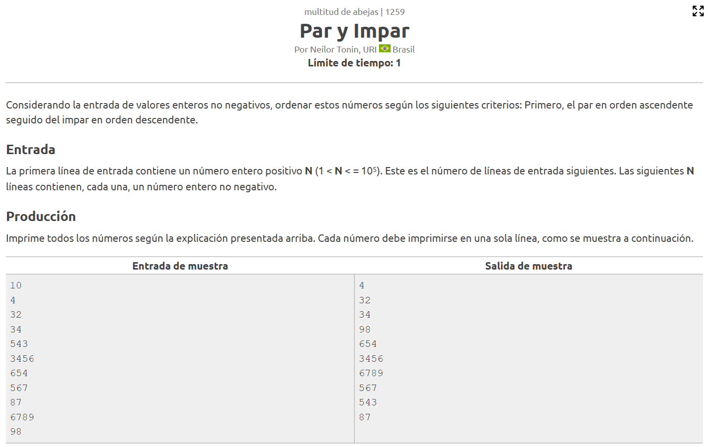
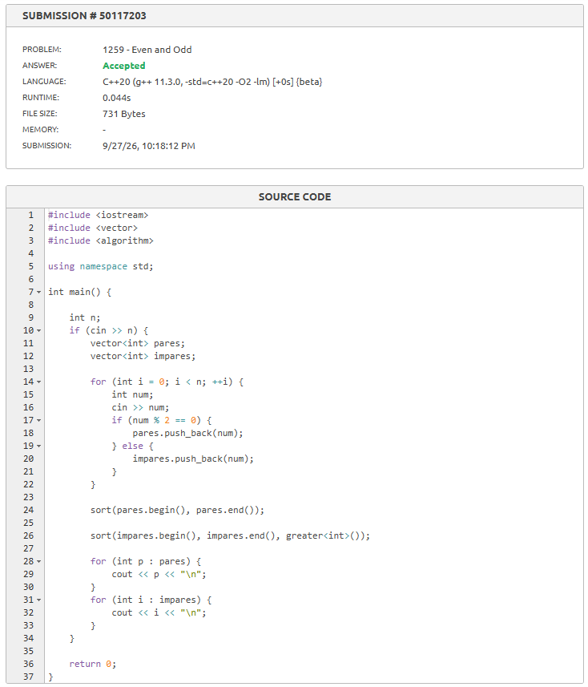
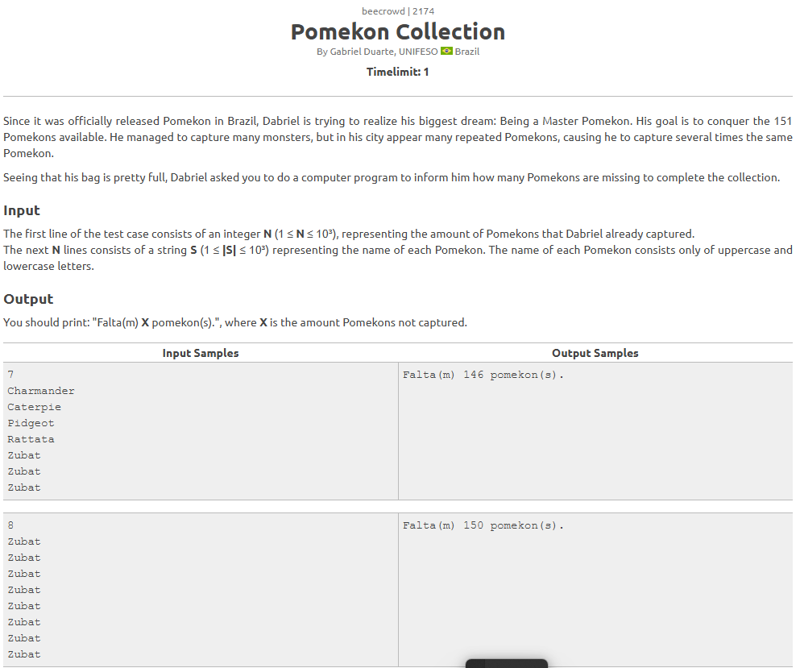
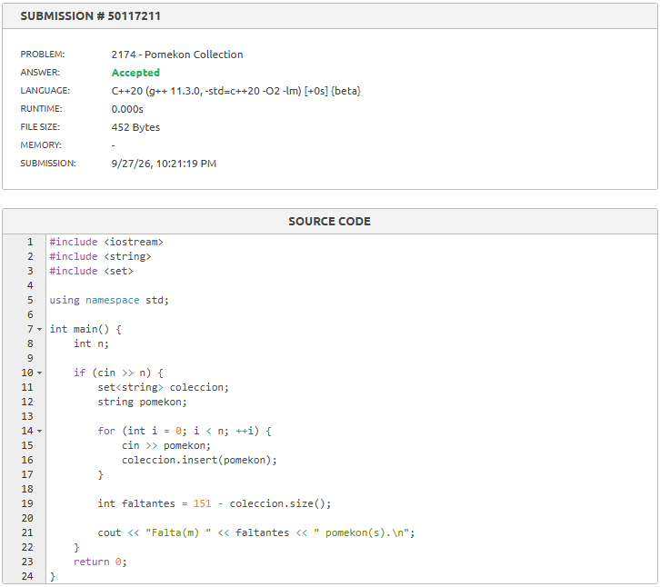

# Semana 6 - Análisis de Algoritmos y Estrategias de Programación  
**Curso:** Análisis de Algoritmos y Estrategias de Programación - 21527 (Remoto)  
**Actividad:** Resolución de casos prácticos Semana 6

---

## Caso 1259
- **Descripción:** Problema *1259*.  
- **Enunciado:**  
    
- **Solución:**  
    

---

## Caso 2174
- **Descripción:** Problema *2174*.  
- **Enunciado:**  
    
- **Solución:**  
  